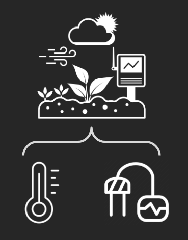
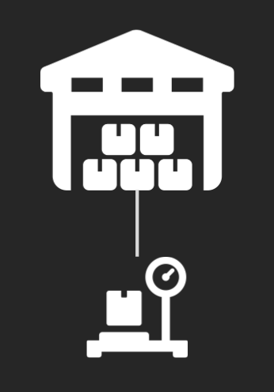
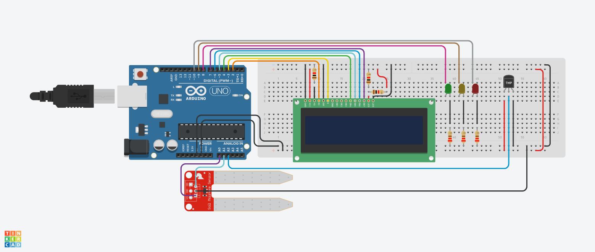
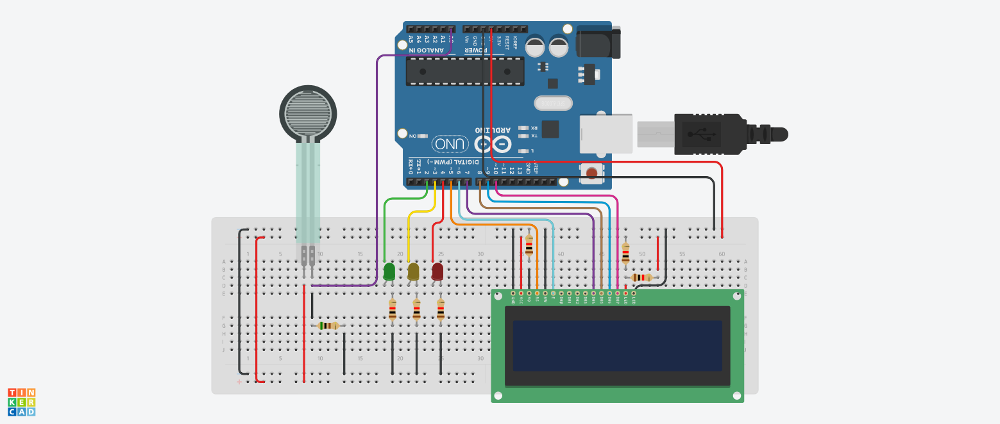

## Global Solution 1º Semestre - Edge Computing and Computer Systems :rooster:

**Nomes + RM dos integrantes:**
- Guilherme Akio - 98582
- Matheus Motta - 550352
- Guilherme Morais - 551981
- Fabrício Saavedra - 97631	
- Vinicius Buzato - 99125

**Turma:** 1ESPW

**Ano:** 2023
___
### Descrição do Projeto - Identificação do Problema
O projeto tem como objetivo atuar no problema que nos foi proposto, a fome no mundo. A fome é um problema global que afeta milhões de pessoas em todo o mundo. Segundo a Organização das Nações Unidas para a Alimentação e Agricultura (FAO), cerca de 828 milhões de pessoas foram afetadas pela fome em 2021, enquanto 2,3 bilhões de pessoas sofrem de insegurança alimentar moderada ou grave.

Garantir as condições ideais para o consumo, e evitar o desperdício de alimentos, é essencial para, além de combater a fome, proteger a saúde, promover a sustentabilidade, economizar recursos e minimizar o impacto ambiental, e é uma responsabilidade de indivíduos, empresas, governos e toda a sociedade.

  
___
### Solução proposta
Tendo em mente este problema, desenvolvemosa a seguinte solução: O uso de uma IA generativa capaz de analisar diversos indicadores específicos para dimensionar o déficit alimentar potencial de uma região.

Esta IA trabalharia com informações como renda média, PIB per capta, inflação e desigualdade de renda, providos por órgãos públicos responsáveis por mensurá-los, mas também dados de controle de qualidade de plantio e de estoque, que são obtidos através de sistemas de hardware desenvolvidos através de diversas plataformas e programas, como o Arduino por exemplo.

Dessa forma, ao receber as informações e analisá-las, a IA será capaz de fornecer um panorama geral da situação da fome das regiões verificadas, possibilitando que ações sociais de remediação sejam mais eficientes.

  
___
### Utilização do Arduino:
Através do Arduino podemos construir circuitos que são capazes de fornecer informações necessárias pela IA em sua análise, como por exemplo:

<table>
  <tr>
    <td></td>
    <td>Um sistema de monitoramento de lavouras, construído com um sensor de temperatura e um sensor de umidade do solo, capaz de verificar se o ambiente possui as condições adequadas para o plantio e, consequentemente, se a safra será quantitativa ou não.</td>
  </tr>
</table>

<table>
  <tr>
    <td></td>
    <td>Um sistema de verificação de estoque, construído a partir de um sensor de força, que pode mensurar a quantidade, em quilos, de alimentos presentes em uma unidade de depósito, ilustrando assim a capacidade de alimentação desta unidade.</td>
  </tr>
</table>

___
### Desenvolvimento do projeto
O projeto foi desenvolvido através de pesquisas por métodos de aplicação da tecnologia na solução, ou amenização, do problema da fome. Utilizando outros projetos como referência e coletando dados de outras IAs generativas, fomos capazes de elaborar nosso projeto e idealizar sua aplicação.   

Já as simulações dos circuitos de hardware que auxiliariam no projeto, foram desenvolvidas utilizando a aplicação web Autodesk Tinkercad, para a elaboração de protótipos e testagem de circuitos e códigos, e a plataforma Arduino, juntamente com seus componentes físicos, para a montagem efetiva dos circuitos.
___
### Montagem física do projeto

### Circuito de Monitoramento de Lavoura :herb:

Para a montagem física do projeto de monitoramento de lavoura, será necessário utilizar:
- Plataforma Autodesk Tinkercad (para reproduzir a simulação exibida [nesta imagem](imagens/Projeto_Tinkercad_Lavoura.png));
- Programa Arduino IDE (juntamente com o código presente [neste arquivo](codigos/Codigo_Arduino_Lavoura.ino) - anexa também sua [versão em txt](codigos/Codigo_Arduino_Lavoura.txt));
- Kit básico de componentes físicos do Arduino, detalhados abaixo:
<table>
  <tr>
    <td><b>Componente</b></td>
    <td align=center><b>Quantidade</b></td>
  </tr>
    <tr>
    <td>Arduino UNO R3</td>
    <td align=center>1</td>
  </tr>
  <tr>
    <td>Resistor 220Ω</td>
    <td align=center>3</td>
  </tr>
    <tr>
    <td>Resistor 1kΩ</td>
    <td align=center>3</td>
  </tr>
  <tr>
    <td>LED Vermelho</td>
    <td align=center>2</td>
  </tr>
  <tr>
    <td>LED Amarelo</td>
    <td align=center>2</td>
  </tr>
  <tr>
    <td>LED Verde</td>
    <td align=center>1</td>
  </tr>
  <tr>
    <td>Sensor de temperatura [TMP36]</td>
    <td align=center>1</td>
  </tr>
  <tr>
    <td>Sensor de temperatura do solo</td>
    <td align=center>1</td>
  </tr>
  <tr>
    <td>LCD 16x2</td>
    <td align=center>1</td>
  </tr>
</table>

Basta agora reproduzir o [modelo do Tinkercad](imagens/Projeto_Tinkercad_Lavoura.png) utilizando os combonentes físicos listados. Para execução, é necessário conectar a placa Arduino Uno R3 a um computador via USB, inserir o [código de execução](codigos/Codigo_Arduino_Lavoura.ino) no programa Arduino IDE e fazer o upload.

### Circuito de Verificação de Estoque :package:

Para a montagem física do projeto de verificação de estoque, será necessário utilizar:
- Plataforma Autodesk Tinkercad (para reproduzir a simulação exibida [nesta imagem](imagens/Projeto_Tinkercad_Estoque.png));
- Programa Arduino IDE (juntamente com o código presente [neste arquivo](codigos/Codigo_Arduino_Estoque.ino) - anexa também sua [versão em txt](codigos/Codigo_Arduino_Estoque.txt));
- Kit básico de componentes físicos do Arduino, detalhados abaixo:
<table>
  <tr>
    <td><b>Componente</b></td>
    <td align=center><b>Quantidade</b></td>
  </tr>
    <tr>
    <td>Arduino UNO R3</td>
    <td align=center>1</td>
  </tr>
  <tr>
    <td>Resistor 1kΩ</td>
    <td align=center>6</td>
  </tr>
    <tr>
    <td>Resistor 500Ω</td>
    <td align=center>1</td>
  </tr>
  <tr>
    <td>LED Vermelho</td>
    <td align=center>2</td>
  </tr>
  <tr>
    <td>LED Amarelo</td>
    <td align=center>2</td>
  </tr>
  <tr>
    <td>LED Verde</td>
    <td align=center>1</td>
  </tr>
  <tr>
    <td>Sensor de força</td>
    <td align=center>1</td>
  </tr>
  <tr>
    <td>LCD 16x2</td>
    <td align=center>1</td>
  </tr>
</table>

Basta agora reproduzir o [modelo do Tinkercad](imagens/Projeto_Tinkercad_Estoque.png) utilizando os combonentes físicos listados. Para execução, é necessário conectar a placa Arduino Uno R3 a um computador via USB, inserir o [código de execução](codigos/Codigo_Arduino_Estoque.ino) no programa Arduino IDE e fazer o upload.
___
### Pré-requisitos
Para execução do projeto é necessário conhecimento sobre o uso da plataforma Autodesk Tinkercad, e experiência com o uso do programa Arduino e de seus componentes físicos. É necessário também saber usos básicos da linguagem C++ para entendimento do código e ajustes necesários.
___
### Resultados esperados e impactos:
O objetivo da solução que idealizamos é melhor ilustrar a respeito da situação da fome em diferentes regiões, e informar adequadamente os agentes responsáveis por ajudar nesta causa, como ONGs e órgãos públicos, de modo que as ações sociais voltadas ao problema sejam mais eficientes e, consequentemente, a fome seja combatida de melhor forma, com as regiões mais necessitadas recebendo um auxílio adequado para sua situação

___
### Links Referênciais
  [Link para o vídeo explicativo do projeto no Google Drive](https://drive.google.com/file/d/1JKsdRvCdB2q_VMbhZHf62jj5Rhz8u8Bt/view?usp=sharing)
  
  [Link para projeto completo do sistema de monitoramento de lavoura no Tinkercad](https://www.tinkercad.com/things/6uTXEucWTuQ?sharecode=RMWx58ar_Whe7_91iB_0qKqRf0W010BUapQFVVjEeeo)
  
  [Link para projeto completo do sistema de verificação de estoque no Tinkercad](https://www.tinkercad.com/things/geOhexWHpS9?sharecode=BIoCpqW3dmfEDWlKwqCt5g-eHpTiZguKVU_gv1iYtxQ)
