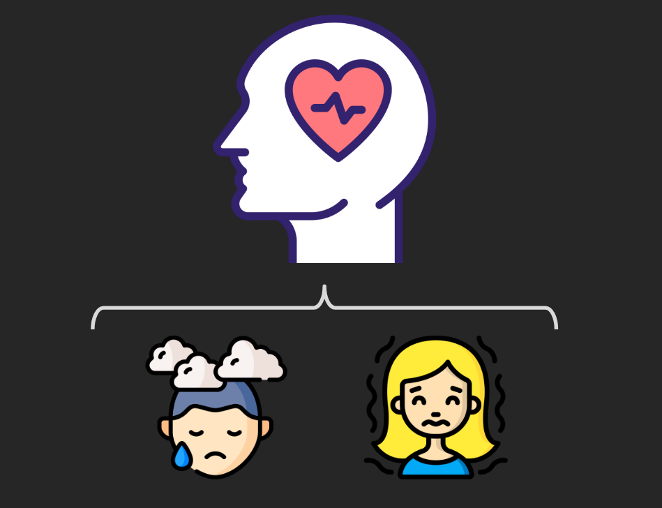
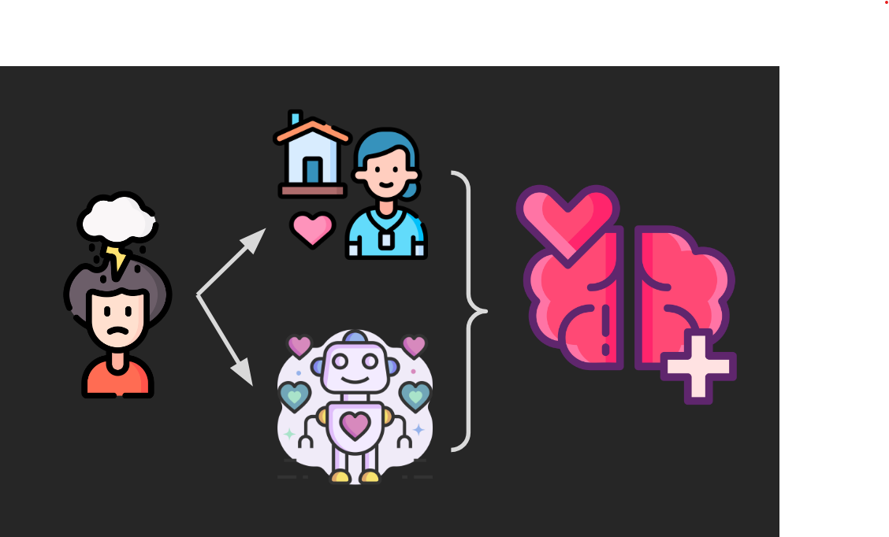

## Global Solution 2º Semestre - Edge Computing and Computer Systems

**Nomes + RM dos integrantes:**
- Matheus Motta - 550352
- Vinicius Buzato - 99125

**Turma:** 1ESPW

**Ano:** 2023
___
### Descrição do Projeto - Identificação do Problema
O projeto tem como objetivo atuar na área de manutenção da saúde mental nas pessoas. Atualmente, milhões de pessoas somente no brasil sofrem de ansiedade ou depressão diagnosticados e dos seus problemas consequenciais. Segundo a OMS, em 2023, 9,3% da população do Brasil é ansiosa, e 5,8% são depressivas.

Garantir um meio para que esse grande número de pessoas afetadas possa tratar, ou ao menos amenizar os impactos dessas doenças (cada vez mais comuns na população), é essencial para garantir uma maior qualidade de vida e seu melhor aproveitamento para essas pessoas afetadas. Essas duas doenças vem se tornado cada vez mais impactates e expressivas, sendo, portanto, um problema que não mais pode ser ignorado.

  
___
### Solução proposta
Tendo em mente este problema, desenvolvemosa a seguinte solução: A criação de uma plataforma de apoio para pessoas que estejam em crise, ou simplesmente sofrendo dessas doenças, e precisem de algum suporte, mas não possuam recursos para acessar um profissional especializado ou precisem simplesmente do contato rápido com alguém que os possa ajudar a amenizar os sintomas no momento.

A plafatorma atuaria em duas frentes: um website onde o usuário possa "conversar" com um robô interativo, capaz de lhe fornecer dicas de como amenizar uma crise sentida no momento, atitudes diárias para diminuir a incidência do problema, ou qualquer outra informação necessária e relevante para a situação do usuário.

A outra frente, apresentada neste repositório, é um circuito físico que o usuário pode facilmente acionar e interagir com, de modo a indicar se está passando por alguma crise no momento, e receber apoio de mensagens e estímulos visuais para amenizar o problema.

Dessa forma, o usuário teria um local de apoio e ajuda para seu problema disponível 24 horas, a postos sempre que ele precisar.

  
___
### Utilização do Arduino:
Através do Arduino, fomos capazes de desenvovler um circuito que atua na forma de um questionário, que indaga ao usuário questões sobre seu estado atual. O usuário, por sua vez, responde ao questionário através de botões, e as respostas são armazenadas em variáveis no sistema, que são então enviadas para a plataforma IOT Tago, onde sofrem todo um tratamento para exibição em Dashboard e notificação a profissionais da saúde que estejam envolvidos com o usuário em questão.

___
### Desenvolvimento do projeto
O projeto foi desenvolvido através de pesquisas por métodos de aplicação da tecnologia na solução, ou amenização, das duas doenças mentais mais comuns na sociedade atual: a Ansidedae e a Depressão.

Utilizamos também outros projetos como referência e coletamos dados de pesquisas a respeito dessas doenças e consultas a IA generativas, dessa forma fomos capazes de elaborar nosso projeto e idealizar sua aplicação.   

Já as simulações dos circuitos de hardware que auxiliariam no projeto, foram desenvolvidas utilizando a aplicação web [Wokwi](https://wokwi.com), para a elaboração de protótipos e testagem de circuitos e códigos, e a plataforma Arduino, juntamente com seus componentes físicos, para a montagem física do projeto.
___
### Montagem física do projeto

Para a montagem física do projeto, será necessário utilizar:
- Plataforma Wokwi (para reproduzir a simulação exibida [nesta imagem](imagens/Projeto_Tinkercad_Lavoura.png));
- Programa Arduino IDE (juntamente com o código presente [neste arquivo](codigos/Codigo_Arduino_Lavoura.ino) - anexa também sua [versão em txt](codigos/Codigo_Arduino_Lavoura.txt));
- Kit básico de componentes físicos do Arduino, detalhados abaixo:
<table>
  <tr>
    <td><b>Componente</b></td>
    <td align=center><b>Quantidade</b></td>
  </tr>
    <tr>
    <td>Placa ESP32*</td>
    <td align=center>1</td>
  </tr>
  <tr>
    <td>Resistor 220Ω</td>
    <td align=center>3</td>
  </tr>
    <tr>
    <td>Led RGB</td>
    <td align=center>1</td>
  </tr>
  <tr>
    <td>Botão de Pressão</td>
    <td align=center>2</td>
  </tr>
  <tr>
    <td>Sensor de Temperatura e Umidade [DHT22]</td>
    <td align=center>1</td>
  </tr>
  <tr>
    <td>Display OLED*</td>
    <td align=center>1</td>
  </tr>
</table>

Basta agora reproduzir o [modelo do Wokwi](imagens/Projeto_Tinkercad_Lavoura.png) utilizando os combonentes físicos listados. Para execução, é necessário conectar a placa ESP32 a um computador via Micro-USB, inserir o [código de execução](codigos/Codigo_Arduino_Lavoura.ino) no programa Arduino IDE e fazer o upload.
___
### Pré-requisitos 
Para execução do projeto é necessário conhecimento sobre o uso da plataforma Wokwi, e experiência com o uso do programa Arduino e de seus componentes físicos. É necessário também saber usos básicos da linguagem C++ para entendimento do código e ajustes necesários.
___
### Resultados esperados e impactos:
O objetivo do nosso projeto é garantir que as pessoas que enfrentam diariamente os disturbios montais mencionados, e garantir uma oportunidade de tratamento e melhora para essas pessoas. Dessa forma, um estilo de vida mais saudável e agradável passa a ser acessível a uma parcela maior da população.

O objetivo da solução que idealizamos é melhor ilustrar a respeito da situação da fome em diferentes regiões, e informar adequadamente os agentes responsáveis por ajudar nesta causa, como ONGs e órgãos públicos, de modo que as ações sociais voltadas ao problema sejam mais eficientes e, consequentemente, a fome seja combatida de melhor forma, com as regiões mais necessitadas recebendo um auxílio adequado para sua situação

___
### Links Referênciais
  [Link para o vídeo explicativo do projeto no Google Drive](https://drive.google.com/file/d/1JKsdRvCdB2q_VMbhZHf62jj5Rhz8u8Bt/view?usp=sharing)
  
  [Link para projeto completo do sistema de monitoramento de lavoura no Tinkercad](https://www.tinkercad.com/things/6uTXEucWTuQ?sharecode=RMWx58ar_Whe7_91iB_0qKqRf0W010BUapQFVVjEeeo)
  
  [Link para projeto completo do sistema de verificação de estoque no Tinkercad](https://www.tinkercad.com/things/geOhexWHpS9?sharecode=BIoCpqW3dmfEDWlKwqCt5g-eHpTiZguKVU_gv1iYtxQ)
